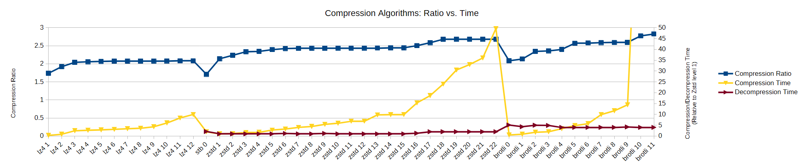

# Q4B (very WIP)

A shoddy imitation of [PH3's P3A archive format](https://ph3at.github.io/posts/Asset-Compression/); it's a data compression tool.

You can also use this as a simple GUI for quickly compressing various files in the supported compression formats. There is also a CLI tool.

As P3A is closed-source (with the file format's header [open source](https://github.com/ph3at/p3a-format/)), I wanted to make my own version. As I do not have a large project to integrate this into, its quality is probably at least an order of magnitude below P3A. But I'm not claiming this is better; it's merely an open-source experiment. Without integrating this into a large project, it's basically just a GUI for compressing files...

### Name explanation

Q4B is named after P3A, specifically a one letter shift forward. This was inspired by [HAL 9000 being a one letter shift backward of IBM](https://en.wikipedia.org/wiki/HAL_9000#Origin_of_name)... and in whatever sleep-deprived state I was in, I thought IBM named itself after HAL, so that's why Q4B is a one letter shift forward of P3A, instead of being named "O2Z." (Also "O2Z" could easily get confused with [`-O2` and `-Oz`](https://gcc.gnu.org/onlinedocs/gcc/Optimize-Options.html), or so I've rationalized to myself.)

## BIG DISCLAIMER

Q4B is under active development. Do not use it for anything serious. Who knows what could happen if it tries to decode an ill-formatted archive.

## Supported compression schemes

* [LZ4](https://github.com/lz4/lz4)
* [Zstandard](https://github.com/facebook/zstd)
* [Brotli](https://github.com/google/brotli)
* [Snappy](https://github.com/google/snappy)
* [stb_compress](https://github.com/nothings/stb/blob/master/deprecated/stb.h)

## Building

0. Prerequisites: a compiler with C++23 support, CMake >=3.20
	* Linux: install [SDL dependencies](https://github.com/libsdl-org/SDL/blob/main/docs/README-linux.md)
	* Only uses SDL's Video and Render subsystems; Joystick can be enabled if you want to use a gamepad to navigate the GUI. GPU is not needed.
	* The `CMakeLists.txt` file sets the instruction set to SSE4.2 by default. If your CPU doesn't have that, change it.
	* C++23 is not strictly needed... definitely requires C++17 for `<filesystem>`, but you could probably add a [replacement library](https://github.com/gulrak/filesystem) given enough time if you want to go earlier. The tests do require C++23 (or honestly C++20).
0. `git clone --recursive -j8 <this repo>` (can change `-j8` to `-j<whatever>` or remove it)
	* If you don't want every submodule because you don't plan on using every compression scheme, you can remove the `--recursive` then `git submodule update --init <submodule>`. Then adjust the CMake `Q4B_ENABLE_XXXX` options. At the very least, you need SDL & ImGui for the GUI, CLI11 for the CLI, and GoogleTest for the tests.
	* **If you want to use stb_compress with MinGW, run this:** `git apply Externals/_patches/0001-stb-fix-defines.patch`
0. In this project's root directory: `cmake -S . -B build`
0. Follow the OS-specific instructions below

### Linux

Compiling:

* GUI: `cmake --build build -j$(nproc) --target q4b-gui`
* CLI: `cmake --build build -j$(nproc) --target q4b`

Running:

* GUI: `./build/q4b-gui`
* CLI: `./build/q4b`

(Optional) Clean when you're done:

* `cmake --build build --target clean`

### Windows

Only Visual Studio is officially supported.

Compiling using CMake:

* GUI: `cmake --build build --config Release --target q4b-gui`
* CLI: `cmake --build build --config Release --target q4b`
* Running: `"build/Release/<q4b or q4b-gui>.exe"`

Compiling using Visual Studio:

1. Open `q4b.sln` (under `build/`)
1. Set build type to "Release"
1. Build `q4b-gui` and/or `q4b`
1. Run (press F5 or Ctrl+F5); defaults to `q4b-gui`, so if you want to run `q4b`, right click its Project and select "Set as Startup Project"

MSYS2 is also supported, though it's not tested regularly:

* Generate the CMake files with MinGW: `cmake -S . -B build -G "MinGW Makefiles"`
	* Note: You will have to `del "build\CMakeCache.txt"` if you already generated the CMake files
* `cmake --build build -j%NUMBER_OF_PROCESSORS% --target <q4b-gui or q4b>`
* `"build/<q4b or q4b-gui>.exe"`

## Running the tests

Linux:

* Compile: `cmake --build build -j$(nproc) --target q4b-tests`
* Run: `./build/q4b-tests`

Windows:

* CMake (MSVC): `cmake --build build --config Release --target q4b-tests` then `"build/Release/q4b-tests.exe"`
* CMake (MSYS2): `cmake --build build --target q4b-tests` then `"build/q4b-tests.exe"`
* Visual Studio: Build `q4b-tests` then run it

## Benchmarking Utility

Test out the various compression schemes, comparing the compression time vs. size! Outputs a CSV, or can generate a plot if you have `matplotlib`.

(Note: LZ4 generic decompression currently doesn't work...)

## Big features remaining

* offset in archive
* dictionary compression
* error handling

## Other TODO list

* CMake: always Release on the submodules
* SDL: drop files only in the box (instead of the entire window)
* *robustness*
* force Endianness when creating/decoding archives
* much other stuff
* streaming files when compressing/decompressing
* P3A compatibility mode?
* set git submodules to shallow

## Contributing

Feel free to!

I barely know what I'm doing, so don't have expectations. And development is inconsistent and may cease at any moment.

## License

GNU General Public License v3.0

### Externals' licenses

* [SDL (Simple DirectMedia Layer)](https://www.libsdl.org/): zlib
* [Dear ImGui](https://github.com/ocornut/imgui): MIT
* [CLI11](https://github.com/CLIUtils/CLI11): BSD-3-Clause
* [GoogleTest](https://github.com/google/googletest): BSD-3-Clause
* [xxHash](https://github.com/Cyan4973/xxHash): BSD-2-Clause
* [LZ4](https://github.com/lz4/lz4): BSD-2-Clause and GPLv2+
* [Zstandard](https://github.com/facebook/zstd): BSD-3-Clause or GPLv2
* [Brotli](https://github.com/google/brotli): MIT
* [Snappy](https://github.com/google/snappy): BSD-3-Clause
* [stb_compress](https://github.com/nothings/stb/blob/master/deprecated/stb.h): MIT or The Unlicense
* [Noto Sans](https://notofonts.github.io/): [SIL OFL 1.1](https://openfontlicense.org/open-font-license-official-text/)

## Acknowledgments

* [PH3](https://games.ph3.at/) and [their blog](https://ph3at.github.io/)
